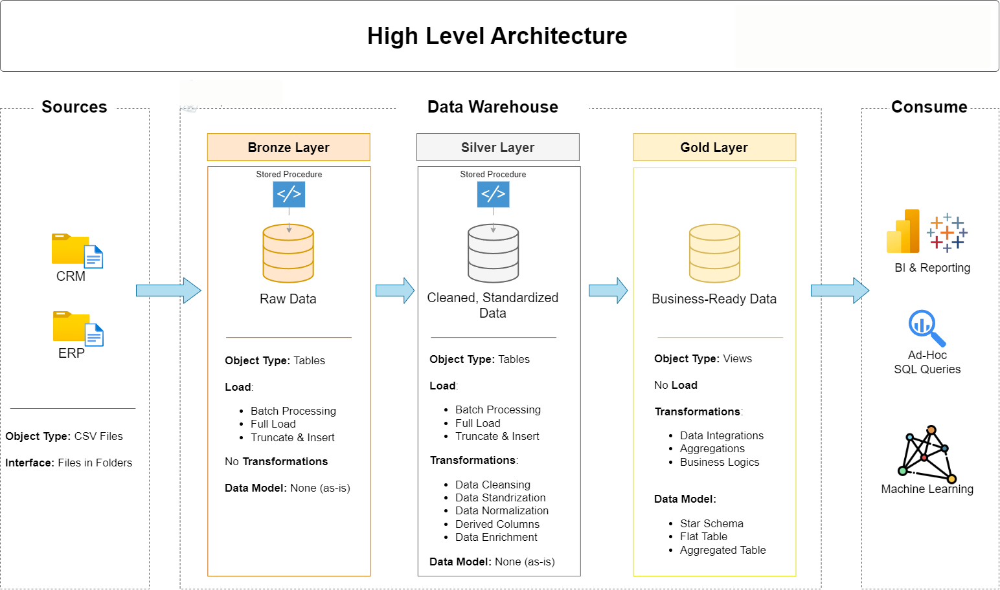

# 📊 Data Warehouse and Analytics Project  

Welcome to the **Data Warehouse and Analytics Project** repository! 🚀  

This project demonstrates a complete **data warehousing and analytics pipeline** using the **Medallion Architecture** (Bronze → Silver → Gold).  
It highlights:  
- Data Engineering  
- ETL Pipelines  
- Data Modeling  
- SQL-based Analytics  

to deliver actionable **business insights**.  

---

## 🏗️ Data Architecture  

The data architecture for this project follows the **Medallion Architecture** with Bronze, Silver, and Gold layers:  

1. **Bronze Layer** – Stores raw data as-is from the source systems. Data is ingested from CSV files into the **MySQL Database**.  
2. **Silver Layer** – Data cleansing, standardization, and normalization processes prepare the data for analysis.  
3. **Gold Layer** – Business-ready data modeled into a **Star Schema** required for reporting and analytics.  

📌 **Architecture Diagram**  
  

---

## 📖 Project Overview  

This project involves:  
1. **Data Architecture** – Designing a modern Data Warehouse using Medallion Architecture layers.  
2. **ETL Pipelines** – Extracting, transforming, and loading data from source systems into the warehouse.  
3. **Data Modeling** – Developing fact and dimension tables optimized for analytical queries.  
4. **Analytics & Reporting** – Creating SQL-based reports and dashboards for actionable insights.  

---

## 🎯 Skills & Tools Demonstrated  

- SQL Development  
- Data Architecture  
- Data Engineering  
- ETL Pipeline Development  
- Data Modeling  
- Data Analytics  

---

## 📂 Repository Structure  

```bash
data-warehouse-project/
│
├── original_datasets/                         # Raw ERP and CRM datasets
│  
├── bronze_layer/                              # Bronze layer scripts
│   └── datawarehouse_bronze_script.sql
│
├── silver_layer/                              # Silver layer scripts & cleaned data
│   ├── datawarehouse_silver_script.sql                
│   ├── datawarehouse_silver_script_steps.sql                  
│   └── cleaned_data/                          # Cleaned CSV files 
│
├── gold_layer/                                # Gold layer scripts & data
│   ├── datawarehouse_gold_script.sql                
│   ├── datawarehouse_gold_script_steps.sql                
│   └── business_ready_data/                   # CSV files
│
├── business_analysis/                         # Business queries and analysis
│   ├── analysis_queries.sql
│   ├── gold_report_customers.csv
│   └── gold_report_products.csv
│
├── docs/                                      # Documentation
│   ├── data_architecture/                     # Overall architecture
│   └── data_flow/                             # Data flow diagram
│
└── README.md                                  # Project overview and instructions
